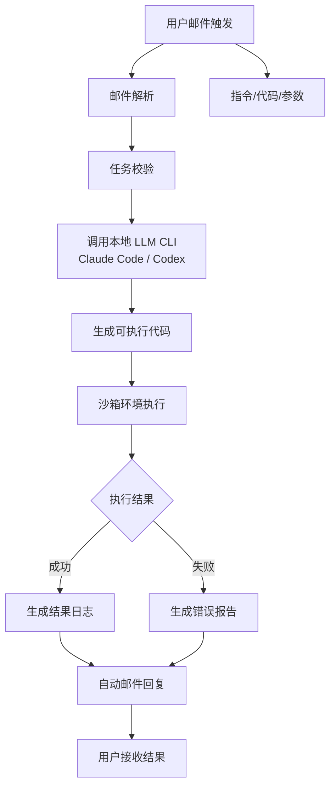
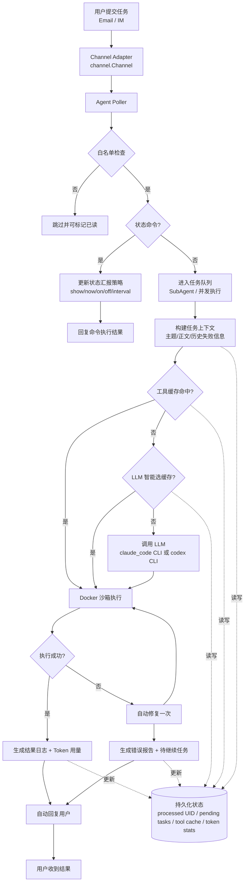

# Email Automation Agent

基于 QQ 邮箱的邮件触发式 Claude Code 自动化系统。

## 功能

- 📧 **邮件接收**: 通过 IMAP 协议轮询 QQ 邮箱
- 🤖 **代码生成**: 调用本地 LLM CLI（Claude Code / Codex）生成可执行代码
- ▶️ **沙箱执行**: 在隔离环境中执行生成的代码
- 📨 **自动回复**: 通过 SMTP 发送执行结果
- 🔌 **通道抽象**: Agent 基于统一 `channel.Channel` 接口，后续可扩展 IM/企业微信/Slack 等

## 快速开始

### 1. 获取 QQ 邮箱授权码

1. 登录 QQ 邮箱网页版
2. 进入「设置」->「账户」
3. 开启「IMAP/SMTP 服务」
4. 生成授权码（不是登录密码！）

### 2. 配置环境变量

```bash
# QQ 邮箱配置
export QQ_EMAIL_USERNAME="your-qq-number@qq.com"
export QQ_EMAIL_AUTH_CODE="your-auth-code"

# 本地 LLM CLI 配置（必需）
# 先确保本机 CLI 可用并已登录
export LLM_PROVIDER="claude_code"   # 或 codex
export LLM_COMMAND="claude"         # 或 codex
```

### 3. 安装依赖

```bash
cd email-automation-agent
go mod tidy
```

### 4. 安装 Docker（沙盒执行必需）

当 `executor.sandbox: true` 时，生成代码会在 Docker 容器中执行（隔离 + 资源限制，网络可配置）。

```bash
docker version
```

### 5. 运行

```bash
go run cmd/main.go -config configs/default.yaml
```

## 配置说明

配置文件位于 `configs/default.yaml`，主要配置项：

### 邮箱配置

```yaml
interaction:
  provider: "email" # email / im
  im:
    platform: "generic"
    endpoint: "${IM_ENDPOINT}"
    bot_id: "${IM_BOT_ID}"
    bot_token: "${IM_BOT_TOKEN}"
    poll_interval: 3s

email:
  imap:
    host: "imap.qq.com"    # QQ 邮箱 IMAP 服务器
    port: 993              # IMAP SSL 端口
    username: "${QQ_EMAIL_USERNAME}"
    password: "${QQ_EMAIL_AUTH_CODE}"
    use_ssl: true
  smtp:
    host: "smtp.qq.com"    # QQ 邮箱 SMTP 服务器
    port: 465              # SMTP SSL 端口
    username: "${QQ_EMAIL_USERNAME}"
    password: "${QQ_EMAIL_AUTH_CODE}"
    use_ssl: true
  inbox: "INBOX"           # 监听的邮箱
  poll_interval: 30s       # 轮询间隔
  max_concurrent_tasks: 3  # 并发处理邮件任务数
  use_subagent: true       # 子代理队列模式
  subagent_queue_size: 200 # 子代理队列长度
  process_latest_on_startup: false # 启动是否立即处理最新一封
  allowed_senders: ["your@email.com"] # 白名单，只有这些发件人会触发任务
```

说明：
- `interaction.provider=email` 使用当前 IMAP/SMTP 邮件通道
- `interaction.provider=im` 启用 IMChannel 骨架（接口已打通，具体平台 SDK 发送逻辑待实现）

### LLM 配置

```yaml
llm:
  provider: "${LLM_PROVIDER}"        # claude_code / codex
  command: "${LLM_COMMAND}"          # claude_code=claude, codex=codex
  model: "qwen3.5-plus"
  max_tokens: 4096
  timeout: 300s
```

### 执行器配置

```yaml
executor:
  sandbox: true
  sandbox_allow_network: true
  timeout: 300s
  allowed_languages: ["python", "go", "bash", "javascript", "typescript"]
  work_dir: "/tmp/email-automation-sandbox"
```

### 缓存配置

```yaml
cache:
  enabled: true
  ttl: 72h
  max_entries: 200
  llm_validate_on_miss: true
```

### 状态汇报配置

```yaml
status_report:
  enabled: true
  interval: 1h
  recipients: ["ops-1@example.com", "ops-2@example.com"]
```

说明：`status_report.recipients` 独立于白名单，不受 `email.allowed_senders` 限制。

### 通过邮件命令动态调整汇报频率

`status_report.recipients` 中的地址可以直接发“控制命令邮件”，无需重启服务，立即生效。

支持命令（主题或正文都可）：

```text
status show
status now
status on
status off
status interval 1m
status interval 2h
status reset
```

中文等价写法也支持，例如：

```text
汇报状态
立即汇报
开启汇报
关闭汇报
汇报频率 1小时
汇报间隔 10分钟
恢复汇报配置
```

说明：
- `status interval` 最小支持 `1m`
- `status now` 会立即触发一次状态汇报
- `status reset` 清除邮件命令覆盖，恢复为配置文件中的 `status_report.*`

## 热加载

程序运行期间会自动检测配置文件变更并热加载（无需重启），常见场景如白名单更新。

- 支持实时生效：`email.allowed_senders`、`llm.*`、`executor.*`、`cache.*`
- 建议仍保持原子修改（先保存完整 YAML，再覆盖）

## 架构图

### 简化流程图（业务视角）



### 详细流程图（工程视角）



## 沙盒说明

执行器默认在 Docker 容器中运行生成代码，核心目标是把“代码执行风险”与宿主机隔离开。

- 隔离边界：每次执行使用独立容器，工作目录挂载到 `/workspace`
- 资源限制：CPU、内存、PIDs 都有上限
- 文件系统限制：容器根文件系统只读，`/tmp` 为受限临时写入区
- 网络策略：通过 `executor.sandbox_allow_network` 控制是否允许联网

## 使用方法

### 发送邮件触发任务

发送任意邮件到你的 QQ 邮箱，邮件内容包含：
- **主题**: 任务简要描述
- **正文**: 详细任务说明

### 示例

#### 示例 1：Python 脚本

**邮件主题**: 计算斐波那契数列

**邮件正文**:
```
请生成一个 Python 脚本，计算并输出前 20 个斐波那契数
```

#### 示例 2：数据处理

**邮件主题**: JSON 数据转换

**邮件正文**:
```
请写一个脚本，将以下 JSON 数组转换为 CSV 格式：
[{"name": "Alice", "age": 30}, {"name": "Bob", "age": 25}]
```

### 接收回复

系统会自动回复一封 HTML 格式的邮件，包含：
- ✅/❌ 执行状态
- 代码说明
- 执行输出/错误信息

### 多轮交互（新增）

当任务信息不足或执行失败时，系统会自动回信请求补充信息。你只需要直接回复该邮件，系统会在原任务上下文中继续执行，而不是从头开始。

## 项目结构

```
email-automation-agent/
├── cmd/
│   └── main.go              # 程序入口
├── internal/
│   ├── agent/
│   │   └── agent.go         # 核心代理逻辑
│   ├── channel/
│   │   ├── channel.go       # 统一通道接口
│   │   ├── email_channel.go # Email 通道适配器（IMAP/SMTP）
│   │   └── im_channel.go    # IM 通道骨架（待接入具体平台 SDK）
│   ├── email/
│   │   └── client.go        # IMAP/SMTP 客户端
│   ├── executor/
│   │   └── executor.go      # 代码执行器
│   ├── llm/
│   │   ├── claude_code_cli.go # Claude Code CLI 客户端
│   │   └── codex_cli.go       # Codex CLI 客户端
│   └── config/
│       └── config.go        # 配置管理
├── configs/
│   └── default.yaml         # 默认配置
└── go.mod
```

## 安全注意事项

⚠️ **重要**: 本系统会自动执行 AI 生成的代码，请注意：

1. 仅受信任的邮箱地址可以触发任务（可在 agent.go 中添加白名单）
2. 代码在沙箱环境中执行，但仍需谨慎
3. 建议添加更多安全限制，如：
   - 网络访问限制
   - 文件系统访问限制
   - 资源使用限制

## 开发

### 添加新的代码语言支持

在 `internal/executor/executor.go` 中添加新的语言处理方法。

### 自定义回复模板

修改 `internal/agent/agent.go` 中的 `sendReply` 方法。

## 故障排除

### 常见问题

1. **IMAP 连接失败**
   - 检查 QQ 邮箱是否开启了 IMAP 服务
   - 确认使用的是授权码而非登录密码
   - 检查网络连接

2. **代码执行失败**
   - 确认相应语言的解释器已安装
   - 查看日志文件 `/tmp/email-automation-agent.log`

3. **邮件发送失败**
   - 检查 QQ 邮箱是否开启了 SMTP 服务
   - 确认授权码正确

## License

MIT
